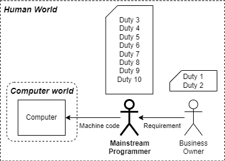
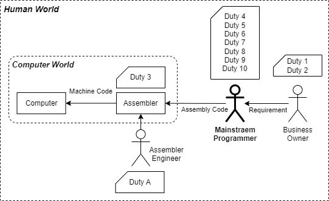
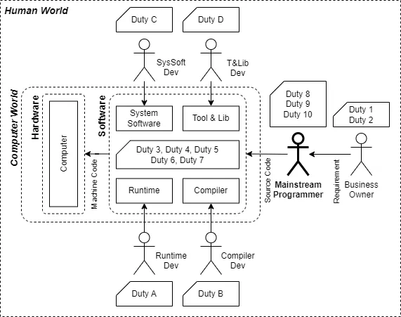
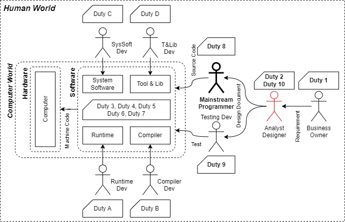
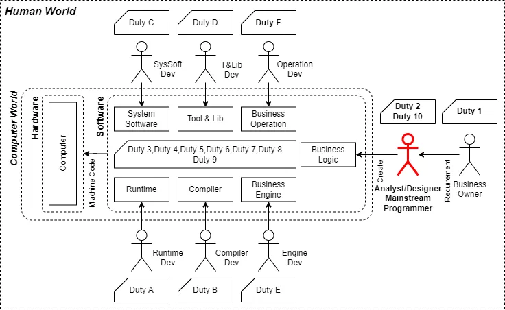
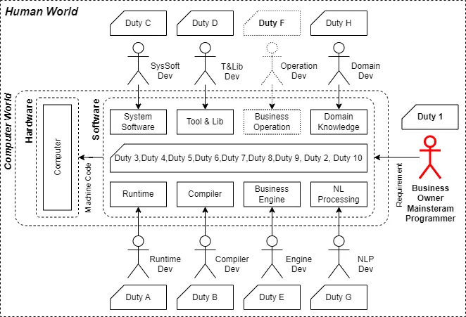

# Overview of BOP

## Introduction

BOP (Business-Oriented Programming) represents a cutting-edge programming philosophy aimed at providing flexible, low-cost, and high-performance IT systems to facilitate rapid iteration and maintenance of business logic within enterprises. The inception of BOP stems from a profound reflection on long-standing issues within the software industry, particularly in the realm of business system development and maintenance. While traditional programming methods have made significant strides on a technical level, they often fall short when faced with complex and ever-changing business requirements. BOP introduces innovative programming concepts and tools to address these challenges, propelling the software industry toward a more efficient and flexible trajectory.

## Core Concepts of BOP

At its core, BOP advocates for the separation of business logic from underlying technical implementations and provides quantifiable standards and algorithms for this separation. Through structured business description models and efficient execution engines, BOP enables rapid adjustments to business logic and high-performance system operations, while also achieving white-box transparency within business systems. This significantly enhances the manageability and maintainability of business systems.

### Business Description Model

As one of the core components of BOP, the business description model is used to model business systems under business-agnostic standards. This model meets the needs of business data processing flow descriptions across various industries. Its core lies in the definition of business logic separation algorithms, ensuring effective separation between logical components and business processing components within the code.

### Flowchart Aggregation Algorithm

Based on the business description model, the flowchart aggregation algorithm analyzes the directed graphs corresponding to the modeled business processing flows, automatically aggregating related operations. This allows for the automatic aggregation and expansion of flowcharts, abstracting complex business processes into more representative work node information within limited screen space.

### Business Execution Engine

The business execution engine is another core component of BOP, which operates on the output results of the business description model to precisely execute predetermined business logic and basic business operations. The execution engine ensures real-time synchronization between program code and design documents, guaranteeing a 100% match between the program implementation and the design documents, thereby achieving the goal of zero logical bugs.

## Review of the Evolution of the Software Coding Industry

Since the 1950s, the software coding industry has undergone several significant technological transformations and industry crises. By re-analyzing and interpreting these historical events, we can better understand the context and significance of BOP's proposition. This article selects the perspective of mainstream programmer responsibilities, exploring the evolution of the software coding industry from a unified standard and a fresh angle, thereby laying a theoretical foundation for further development in the software coding industry.

### Early 1940s-1950s: The Machine Code Era

In the early days of electronic computing, mainstream programmers were primarily scientists who directly created computer hardware. They generally held doctoral degrees in disciplines such as mathematics and physics, and the programming languages they used were binary machine languages. These programmers had to convert business requirements directly into binary machine language, making their work both arduous and complex.

### Early 1950s-1960s: The Assembly Era

With the advent of assembler programs, mainstream programmers could directly use assembler programs provided by hardware manufacturers for program creation. Assembly program engineers were responsible for writing specialized software that mapped mnemonics to the CPU, while mainstream programmers no longer had to worry about the corresponding mapping process. The emergence of task division allowed fewer people to provide foundational tools for more people, tools that were thoroughly tested and could reliably accomplish expected tasks. The knowledge domains mainstream programmers needed to learn were narrowed, and their responsibilities were reduced, enabling them to accomplish more work.

### 1960s to Present: High-Level Languages and Software Engineering

We believe that the primary tool for resolving the first software crisis was the advent of high-level languages, while the resolution of the second software crisis was primarily due to the emergence of IT infrastructure software brought about by object-oriented programming. High-level languages further abstracted the business abstraction level of coding results, distancing mainstream programmers further from hardware and operating systems and allowing them to focus more on expressing business concepts. We have selected representative modules to illustrate the characteristics of this era.

1. **Compiler**: High-level languages are primarily compiled languages. High-level languages further abstract the business abstraction level of coding results, distancing mainstream programmers further from hardware and operating systems and allowing them to focus more on expressing business concepts, although in practice, they mainly express data processing concepts.
2. **Runtime**: Runtimes typically include interpreters and are a feature of more modern high-level languages. Runtimes further isolate many basic programming details, such as pointer operations, garbage collection, and boundary checks.
3. **Tools and Libraries**: The tools and libraries in the diagram primarily refer to external libraries that contain general algorithms or specific functionalities referenced in the source code. They also include efficiency tools for assisting mainstream programmers in their development work, such as IDEs and debugging tools.
4. **System Software**: System software encompasses many aspects, including hardware drivers and some tools that are also considered system software. We have not fully expressed all components in the diagram. In this diagram, system software emphasizes IT infrastructure services, such as databases, caches, queues, and network servers.

The advent of high-level languages allowed mainstream programmers to completely break free from the mnemonics closely associated with the CPU. With the cross-platform capabilities of compilers, high-level languages could run on a wider variety of CPUs. The information contained in the source code and the knowledge mainstream programmers had to learn were redefined. A mainstream programmer who does not know how to manipulate pointers can still become one of the best programmers in the world.

Runtimes and compilers provide mainstream programmers with more semantically rich high-level languages. The focus of mainstream programmers shifted from effectively controlling registers, pointers, and designing clever data structures to spending most of their time focusing on business data processing logic, performing various data set operations, and handling reasonable I/O and business exceptions.

The explosion of system software, tools, and libraries was clearly aided by the concurrent rise of object-oriented programming and design patterns. A large amount of IT infrastructure was standardized, allowing mainstream programmers to further distance themselves from software functionalities that could be reused across projects.

The responsibilities of mainstream programmers have significantly decreased by over 50%. Whether it is the entry difficulty for someone to become a programmer or the amount of business-related code output per day for a programmer, there has been a significant improvement. This is the most important factor in resolving the second software crisis.

One factor not included in the diagram is the SaaS/CI/CD technologies that have flourished since 2010. These technologies have significantly contributed to increasing the iteration speed of software teams. However, since they have little impact on the responsibilities of mainstream programmers, they are not reflected in the diagram.

Next, we will discuss a concept that was introduced as early as the 1960s: software engineering. The most important aspect of this is the responsibility of requirements analysis and design. We can see its position in the diagram below. Software engineering has effectively promoted and standardized software project development. Further division of labor has further reduced the responsibilities of mainstream programmers.

From this historical trajectory, we can clearly see how the responsibilities of mainstream programmers have gradually evolved with the development of programming languages, programming tools, and the improvement of software engineering. Initially, one person would handle all tasks, but over time, this has transitioned to a collaborative division of labor across various roles. For the four roles on the right side, we have emphasized their responsibilities to indicate that these roles have a deep understanding of the actual business logic of the target commercial project. In contrast, the four roles on the left side are responsible for maintaining public foundational modules and do not directly face the business requirements of the final project.

By reviewing the historical development of the software coding industry from the perspective of mainstream programmers, we can see a more fundamental pattern beyond the surface phenomena of multiple software crises. The responsibilities of mainstream programmers have been continuously decomposed. Their work has shifted from doing everything independently to being supported by numerous third-party, well-tested, and reliable foundational components. The complexity of work that a single individual can handle is inherently limited. Division of labor can reduce the complexity of each individual's work. Good tools can also reduce the actual complexity of the work. With strong tool support, the knowledge structure of mainstream programmers is continuously changing. More people can become mainstream programmers without necessarily holding a PhD degree. This has a significant positive impact on the development of the entire coding industry.

Now, let's examine this diagram in the context of the issues facing the software coding industry. A clear core role is the requirements analysis and design role. Currently, no university or company provides a definition of the minimum information set for a requirements document. Since the inception of the software coding industry, we have lacked quantifiable and repeatable evaluation standards for requirements documents to ensure the completeness of the information they describe. We actually rely on rapid feedback and iteration during the final implementation phase to gradually improve requirements documents that may be missing information. Theoretically, we have no reliable methods to discover issues in the documentation before actual code implementation. Furthermore, based on the existing software engineering processes, reporting, feedback, and synchronization of information related to requirements issues within a certain scope can lead to increased communication and dissemination costs. We know that the earlier a problem is discovered, the lower the cost, but we have no scientific methods to achieve this goal. The software coding industry actually faces many issues similar to requirements documents, where "we should do this, but we don't actually want to do it."

In the current state, with the existence of numerous issues similar to software requirements analysis and design and the lack of effective long-term solutions, we can see that the scope of responsibilities for programmers is already very limited. The bottleneck hindering the efficiency of software coding is likely not the coding tools and foundational components but the software engineering theory itself. How to further coordinate these tasks to reduce costs and how to further decrease the actual workload of project development are urgent demands for the software coding industry in the era of digital operations.

## Industry Issues

### Common Problems

The software coding industry faces numerous unresolved issues, both large and small, that have appeared at various times. Here are some types of problems that are common in the software coding industry but are relatively rare in other industries:

1. **Low Adoption of UML**: UML (Unified Modeling Language), introduced in 1997, is considered a very excellent tool. However, the actual usage rate of UML in the overall software coding industry is estimated to be less than 10%. Most programmers do not publicly claim that UML is useless, but they rarely make efforts to increase its usage frequency in practical work.

2. **Low Popularity of TDD and DDD**: Test-Driven Development (TDD) and Domain-Driven Design (DDD) emerged around 2002-2003 and are recognized as very excellent software development models. However, the actual usage rate of TDD and DDD in the overall software coding industry is estimated to be less than 10%. Most programmers do not publicly claim that they are useless, but they rarely make efforts to increase their usage frequency in practical work.

3. **Incomplete Requirements Documentation**: The history of software requirements analysis and documentation is almost as long as software coding itself. However, for most programmers, requirements analysis and documentation are things they do not publicly claim are useless but never make efforts to write 100% complete documents in practical work.

### Specific Problem Analysis

1. **Function Length and Code Standards**: How long or short should a function be? Even with numerous coding standards and using only one coding language's standards, it is difficult to find a unified version. We have many IDE tools that provide design-time syntax analysis, even code standard analysis. However, besides the total number of lines and code logic complexity indicators, there is no algorithmic or automated theory for how long a function should be.

2. **Completeness of Requirements Documentation**: What information must a requirements document contain to be considered qualified? How to evaluate the completeness of a requirements document? The answer is likely no. Although we can explain that requirements are difficult to describe completely at once, whether there are significant logical errors or omissions in the requirements document in front of you, and whether there are algorithmic tools to assist in analysis, the answer is clearly no. This means that requirements documentation does not have strict content constraints. This sufficiently explains why software development is an unreproducible process. Because from the beginning, the starting point is an uncertain, probabilistic, and luck-based thing.

3. **Intergenerational Inheritance of Programming Skills**: When there is no quickly learnable theoretical knowledge, programming skills are merely an accumulation of personal experience, and the efficiency of intergenerational inheritance of experience is low. From 1950 to the present, the rapid development of the software coding industry has been supported by the high annual growth rate of the total number of programmers. We cannot determine whether the total number of people in the software industry will continue to rise rapidly in the future. Simultaneously, the increase in the overall industry population will inevitably lead to a decrease in average ability. We can be certain that the total demand for information processing in 50 years will be significantly greater than in 2024, and we are currently in the midst of a software crisis.

### Commonalities and Solutions

The commonality of the aforementioned issues is that while some theories and models are acknowledged, they are simultaneously and for decades actively abandoned in engineering practice. The software coding industry faces numerous challenges, from low tool usage rates to incomplete requirements documentation, and issues with intergenerational inheritance of programming skills. These problems not only affect the efficiency and quality of software development but also limit the further development of the industry. The proposition of BOP (Business-Oriented Programming) aims to address these long-standing issues by providing more flexible, lower learning, and maintenance-cost IT systems to help enterprises achieve rapid iteration and maintenance of business logic.

## Low-Code/No-Code and Workflow

### Pressure and Solutions for Digital Operations

With the proliferation of digital operations, enterprises' demands for IT systems have significantly changed. Traditional software development models struggle to keep up with rapidly changing business needs. To address this issue, the software coding industry has proposed various solutions, including low-code/no-code platforms and workflow technologies.

### Challenges of Low-Code/No-Code Platforms

Low-code/no-code platforms emerged around 2015, aiming to help non-technical users quickly build applications through visual programming and pre-built components. These platforms achieve relatively higher productivity compared to traditional coding methods by restricting end-users to operate within the capabilities provided by the platform.

However, the extensibility of low-code/no-code platforms is limited. Once the business model of the end-user changes, the platform's extensibility is challenged. If end-users do not have sufficient technical resources to maintain the low-code/no-code platform, they gradually become restricted in their ability to adapt to business changes.

### Limitations of Workflow Technologies

Workflow technologies have a longer history, aiming to visualize and control business processes through graphical methods. Each workflow node represents a business operation, and the connections between nodes indicate the logical sequence of business processes.

The main issue with workflow technologies is that when the complexity of nodes is too high and not timely subdivided, the significance of the workflow diminishes. Conversely, when nodes are too finely divided, the information density of expressing business logic in a graphical manner becomes too low. A workflow with 50 nodes might require a 100-inch display, resulting in a poor user experience. Workflows are more often used for higher-level business logic visualization management rather than managing the execution flow of individual functions within code.

### BOP's Role in Advancing Related Fields

Although low-code/no-code platforms and workflow technologies have partially addressed some issues, they have not truly resolved the fundamental challenges faced by the software coding industry. The extensibility issues of low-code/no-code platforms and the complexity issues of workflow technologies limit these solutions in practical applications. The proposition of BOP (Business-Oriented Programming) aims to address these long-standing issues by providing more flexible, lower learning, and maintenance-cost IT systems to help enterprises achieve rapid iteration and maintenance of business logic.

## Changes Brought by BOP

After introducing BOP, we can further observe possible changes through graphical representation:

1. **Convergence of Mainstream Programmer and Analysis & Design Roles**

   In the BOP model, the roles of mainstream programmers and analysis & design personnel gradually converge. Analysis & design personnel can freely and autonomously design and express business logic, reducing communication steps and accelerating design feedback. Although business operation engineers are also a result of the division of mainstream programmers, their responsibilities are less related to business logic changes. Thus, the roles that previously analyzed and defined business logic gradually become mainstream programmers.

2. **Simplification of Testing Work**

   The original testing role disappears from the diagram, but this does not mean testing is unnecessary. Similar to branches like system software and compilers, each branch must have its own testing process. However, based on BOP theory, testing work is indeed significantly simplified. Theoretically, business logic requires no testing because the business logic engine 100% ensures that the execution process and results fully match the business logic design documents. This is similar to how the output of a compiler 100% matches the source code design logic. BOP aims to reduce the number of bugs caused by human negligence and misinterpretation of requirements to zero. This eliminates the need for unit tests, integration tests, and even regression tests. Under the BOP model, these tests are meaningless.

   What is truly meaningful is the validation of the logical completeness and rationality of business logic before coding. After expressing business logic, various verification tools and methods can be used to comprehensively review and verify the business logic, thereby identifying potential design issues early in the design phase. The time allocation for project development can reduce testing and development time and increase demand analysis and design time. Ultimately, with less overall time, a high-quality business information processing system with complete documentation and logic can be delivered. This kind of verification has always existed in the industry, known as static formal verification of software. BOP will strive to promote the popularization of formal verification, lower costs, and the ability to introduce formal verification in the demand analysis and design stages.

## BOP Specifications

### More Coding Restrictions

If direct use of `goto` were not prohibited, there would be no clearer and more concise structured programming languages. If direct use of pointers were not prohibited, there would be no stronger modern programming languages. Each major development in the software coding industry has been accompanied by restrictions on programmers' coding abilities. Most modern programmers may not be able to imagine the difference in machine language code required to write an addition in machine code versus any high-level language to perform the corresponding function. More final execution code and slower overall execution speed are required to obtain program source code with more meaningful business abstraction.

### Business Logic Separation

Business logic separation has long been a goal in the software coding industry. However, due to the lack of clear execution standards, there are no auxiliary tools for verification. As a result, most small and medium-sized projects rely almost entirely on the personal professional abilities of programmers to abstract business logic under various real-world pressures, with almost no effective review.

The definition of basic business operations refers to those IO operations and external library calls that do not involve any business judgment in a specific business system. These can be considered atomic, basic, and operationally meaningful. After effectively identifying basic business operations, over 95% of the remaining code is business logic code. Business logic in a system may change daily, but the frequency of changes in basic business operations is much lower. Moreover, the reasons for changes in basic business operations are often unrelated to business logic changes.

When we effectively identify business logic and document it in a structured manner for storage and expression, the business logic of the entire system becomes clear to users. Users can quickly obtain various information within the current system through various query methods, such as the number of times a function is used or the locations where certain business data is used. It is even possible to perform static formal verification of the entire system's code. This can significantly reduce the cost of eliminating losses caused by extreme scenarios that occur once in a century at an early stage. Although this data can currently be provided by some IDEs, product managers also need this data. They urgently want to know how many business processes will be affected by changes in the definition of certain business data. BOP can provide a metadata management system for the information system itself to meet these needs.

### Documentation First

After analyzing commercial systems using the BOP model, a large amount of analysis results more detailed than traditional demand analysis is formed. This allows for the effective evaluation of the logical completeness of existing requirements through algorithmic tools before actual code development, thereby making the dream of effectively identifying project risks early in the project phase a reality in software engineering.

The BOP model emphasizes documentation, and it is structured/semi-structured. Projects built on the BOP model have design documents that are fully synchronized with the project. In fact, BOP emphasizes having documentation before code implementation. This trend has already been felt by many programmers with the widespread application of LLM—code is just the output result of document description. For business programmers in large commercial systems, BOP's recommendation is to write documentation, not code.

## BOP's Vision

### Multi-System Integration

A standalone BOP system offers significant benefits to the commercial enterprises using it. However, BOP's goals extend beyond this. BOP achieves effective separation of business logic and business processing, ensuring system decoupling. Therefore, integrating and replacing different systems becomes easier. Especially when multiple systems adhering to BOP theory are integrated, the quality of system integration is far superior to any existing models from the outset, thanks to the documentation-first standard. The input and output of two systems have fully trustworthy documentation as a starting point.

### System Rewriting

A recent software crisis is the high maintenance costs of historical systems, which are so exorbitant that enterprises are willing to accept redeveloping systems without complete testing and under business risks, gradually replacing the original systems. Existing tools do not adequately support identifying complete business logic from code. Additionally, newly developed systems still face potential technical maintenance issues, merely postponing the problem, with future contingent costs needing to be marked on financial ledgers.

BOP-based systems provide detailed and accurate business logic descriptions. Whether using automated coding tools for reimplementation or using these descriptions for fully functional coverage testing, there are reliable foundational documents. This will make IT system maintenance costs more transparent and controllable.

### BOP and 4GL and NLP

With the continuous maturity of LLM, natural language processing capabilities enable end-users to interact more freely with application systems. With the assistance of natural language processing modules and domain-specific knowledge, we can further envision future changes in the BOP model.

A significant change at this point is the disappearance of the definition of mainstream programmers. In the diagram, this concept is represented by a dashed line. In fact, this is a way to realize the concept of "everyone being a programmer." Requirements will directly enter the software system from the business side through natural language interaction, completely changing the existing software development model, theoretically reducing communication costs to a minimum.

Another possible change is the potential disappearance of the role of business operation engineers. When the coding patterns recommended by BOP are accepted, the business meaning inherent in basic business operations has already been fully described in relevant documentation. Implementing a data access layer is not a task that requires deep business understanding. Many system I/O operations can be completed using standardized SDKs, providers, or clients. Automatic generation of source code at the module level based on large language models is already on the verge of industrialization. What we likely need is merely an industrialized standard, such as the BOP specification.

Fourth-generation programming languages (4GL) have been a long-term subject in the software coding industry. BOP achieves a domain-agnostic description model, a commercial business process description model. Similar to SQL, which targets data relationships and query domains, BOP can derive a unified description standard for commercial business processing flows. In the era of object-oriented programming, abstraction often resulted in more specific implementations. Various DSLs also addressed actual domains rather than more generalized coding or program processing flows. Therefore, when we abstract from the program execution domain itself and obtain a metadata description unrelated to specific software project domains, we naturally get a universal language capable of expressing program processing flows. This is likely a fourth-generation programming language in the coding domain. SQL describes data structures and operations, while BOP describes data processing flows.

Natural language programming has been a long-term dream. Current breakthroughs in natural language understanding for LLM have become a reality. Large language models can fully recognize natural language descriptions and output corresponding programmer code. However, a problem is that for large modules and overall projects, the performance of large models is not ideal. From the BOP perspective, this is not due to the insufficient capabilities of large models but our inability to accurately describe actual coding intentions in natural language. Additionally, many inherent flaws in natural language make it unsuitable as a tool for describing larger-scale logic directly. Introducing an intermediate layer between natural language and high-level language source code would exponentially reduce the difficulty of generating source code from natural language. BOP, as a process description tool, can perform core metadata-carrying work in this intermediate layer.

## Conclusion

We reviewed the history of the software coding industry, analyzing the possible development trends and patterns from the perspective of the changing responsibilities of mainstream programmers. From the development trends of commercial software, we pointed out that the core needs of future enterprise users will shift to low-cost rapid iteration of their business logic, low-cost maintenance of IT systems, high-quality documentation, and the ability for business information within IT systems to be easily accessed by anyone concerned with related business, including but not limited to product managers, business managers, and company executives.

BOP can build a user-friendly business process information management system for non-IT personnel. It allows mainstream programmers in the software coding industry to further distance themselves from underlying implementation technologies, enabling more people to become new mainstream programmers and deepening the integration of mainstream programmers with actual business operations. Ultimately, it will promote the realization of natural language programming and the fourth-generation universal programming language.
