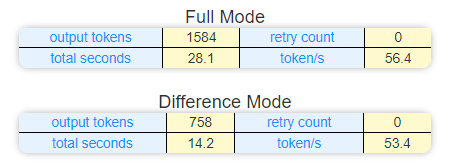
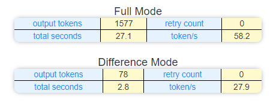
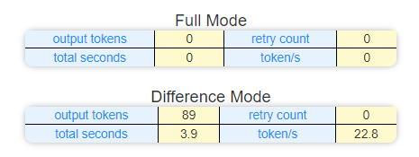

# Optimization Research on LLM Differential Output

## Abstract

This paper explores the optimization of Large Language Model (LLM) output in code assistance scenarios. Research shows that by introducing a differential output mechanism, code modification efficiency can be significantly improved while reducing resource consumption. The article proposes a solution based on the diff format, achieving precise code location positioning and efficient update processing. Experimental results demonstrate significant performance advantages of this solution across various code modification scenarios.

## Problem Background

In LLM-assisted programming, code modification is a core application scenario. Current common code modification patterns can be divided into three categories: complete rewrite, large-scale modification, and local fine-tuning. Most LLM models output complete file content by default. However, in actual development, local modification needs dominate. Therefore, achieving precise code snippet output is crucial for optimizing response time and reducing computational resource consumption.

Traditional code snippet processing solutions face positioning difficulties: due to the lack of accurate location information, many AI tools use line-by-line search methods to determine modification locations. This approach often leads to significant performance degradation when dealing with duplicate content or large files, affecting user experience.

## Technical Solution

To address these issues, this study proposes using the mature diff format as an output specification. This solution requires LLM models to output precise file location information when generating modification content. By integrating LLM's intelligent output capability with client-side efficient processing mechanisms, optimal performance in code updates is achieved.

## Experimental Validation

This study validates the effectiveness of the solution through three experimental scenarios:

1. **Comment Rewriting Scenario**
   - Source file size: ~1350 tokens
   - Task objective: Full-text comment rewriting
   - Results show precise comment positioning and updating
   

2. **Minor Modification Scenario**
   - Source file size: ~1350 tokens
   - Task objective: Class name modification
   - Validates the solution's efficiency in single-line modification scenarios
   - The most frequent operation during code maintenance is making small modifications, where the differential mode achieves an average wait time of less than 4 seconds
   

3. **Large File Processing Scenario**
   - Source file size: ~12k tokens (73k characters)
   - Task objective: Function implementation replacement with empty implementation
   - Optimized file: 1.2k tokens (6.6k characters)
   - Through a special deletion operation optimization algorithm, the information of deleted text that LLM needs to return is compressed, achieving an order of magnitude efficiency improvement
   

## Conclusion and Outlook
The differential output solution proposed in this study successfully addresses efficiency issues in LLM code modification scenarios. By adopting the diff format specification, precise code positioning is achieved while significantly reducing resource consumption. Experimental results show that this solution performs excellently across various modification scenarios, particularly demonstrating significant performance advantages when processing large files.

Future research directions can explore optimization strategies in more scenarios, such as multi-file collaborative modification and complex refactoring scenarios, further enhancing LLM's application efficiency in software development.
