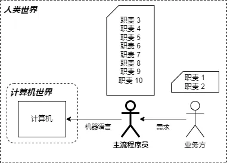
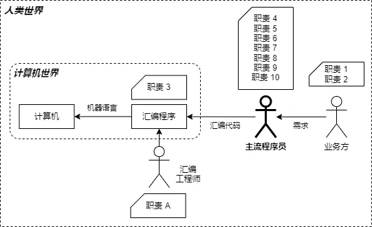
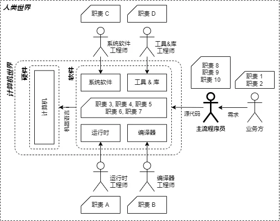
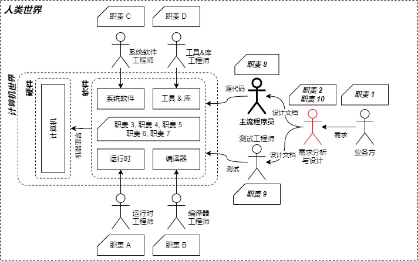
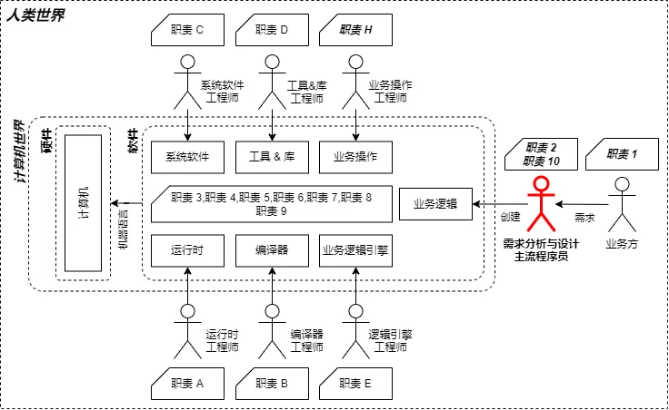
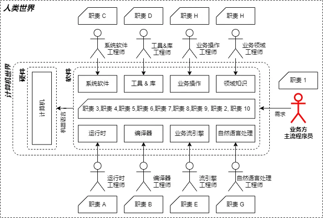

# BOP指南

## 概述

本文介绍了BOP这个概念的历史发展，指出文章研究所针对的软件行业的相关问题。通过回顾软件编码行业的发展并总结了其没有被广泛认知的规律，进一步对BOP进行有针对性的定义以确立研究的范围和目的。文章深入探讨了基于更加明确的BOP定义对于解决软件行业长期存在的各种问题的意义。指出了大量历史问题的解决方向。文章最后讨论了4四代编程语言和自然语言编程这两个长期没有明确方案的领域在新的BOP理念的帮助下面临突破的可能

## 背景

在20世纪60年代开始就有目的为了Business目的而创建的[Programming Language for Business](https://en.wikipedia.org/wiki/Programming_Language_for_Business)理论和语言。例如[COBOL](https://en.wikipedia.org/wiki/COBOL)就被认为是一种通用的面向业务的语言。

在1984年，计算机科学家Donald Knuth提出了[literate programming](https://zh.wikipedia.org/wiki/文学编程)。
文学编程的文档作为写程序的一部分而产生。替代注释作为源代码的附注提供，文学编程包含每一层概念的解释，将较低级别的概念推迟到适当的位置，允许了更好的想法交流。第一个发布的文学编程环境是WEB，由高德纳于1981年为他的TeX排版系统而引入。

软件编码行业一直在努力进行业务领域的抽象，目标是能使用通用的、规范的方式对无穷的业务领域进行处理。在面向对象被整个软件编码行业大范围接受和应用后，2003年Eric Evans在其的著作《领域驱动设计：软件核心复杂性应对之道》中首次提出，并同时指出DSL在其中的使用。DDD的核心思想是将软件开发的重点放在业务领域上，通过深入理解业务需求和领域知识，构建出能够反映真实业务逻辑的软件模型。

因此如何在源代码之上进行业务描述是软件编码行业的长期目标。虽然历史上所有的探索虽然都得到了理论上的认可，但是没有任何一个理论最终被行业实践所认可。其高昂的学习和维护成本使得相关理论的应用成为几乎所有的中小团队拒绝采纳，甚至大团队也不愿意100%遵守相关理论的约束。

我们还会涉及到第四代编码语言的研究。如何构造一个具有更通用的、更语义化的编码语言一直是高级编码语言普及后软件编码行业的研究方向之一。但是除了SQL以外，至今没有任何一个被广泛认可的具有跨领域业务描述能力的语言出现。

在2015年以后，整个信息化产业的发展速度出现了显著的放慢。创建新业务系统的需求占比逐渐下降，因为从无到有的浪潮已经渡过了其最高速发展的时期。维护现有系统，调整现有系统的业务比例则在不断上升。同时对于深入数字化运营的企业而言，基于数据的业务决策已经成为现实。新的需求则是希望IT系统业务逻辑调整的周期能跟得上最终可能以小时为单位的迭代。

这种需求催生了低代码和无代码平台的研究。但是将近10年的研究我们大致可以确定，基于现有的低代码和无代码理论，只能实现在有限范围内的高速迭代。低代码或无代码平台只能在合适的范围内支持快速业务变更。同时对于平台的持续维护，增加其可配置能力对于原有系统复杂度的增加也是显著的。持续维护的成本上升速度决定了其显然存在一个上限，使得平台不可能完全实现以小时为单位的业务迭代。

基于以上的历史和现实，我们提出全新的面向业务编程的定义。以服务于业务系统为主要核心目标，以提供更为灵活，更低学习成本、维护成本的IT系统为核心目标。降低商业企业对于额外IT团队的依赖以及持续的成本指出，提供更高效的业务逻辑决策信息。

## 行业问题

一个主要基于经验传承的行业，非常依赖其使用的工具的效率提升，如同100年前的木工和如今木工一样。工具会更快完成重复性的工作，或者代替一些原本需要人类亲自完成的工作。软件编码行业显然也同样会出现这些趋势：编码工具会做更多事。所以我们有必要研究哪些事情会成为工具的能力。

每个行业都有一些尚未解决问题，问题或大或小，出现时间或早或晚，在软件编码行业同样存在这个现象，这不足为奇。然而以下现象除了在软件编码行业内非常普遍，在其他行业则非常罕见。这显然暗示了在软件编码行业存在一些非常特殊和不合理的状况。

当我们以软件编码人员为整体来讨论时：

1. UML1.0是1997年诞生的，至今被认为是一个非常优秀的工具。但是在整体软件编码行业，其实际的使用率估计很难超过10%。即使已经有了大量的生产力工具，但是UML对于大部分程序员而言，是一个不会公开声称它没用，但从来不会在实际工作中努力扩大其使用频率的工具
2. TDD和DDD大约诞生于2002-2003年，至今被认为是非常优秀的软件开发模式，被公认是一种理想的软件开发模式。但是在整体软件编码行业，其实际的使用率估计很难超过10%。即使已经有了大量的生产力工具，但是TDD和DDD对于大部分程序员而言，是一个不会公开声称它没用，但从来不会在实际工作中努力扩大其使用频率的工具。
3. 软件需求分析和需求文档的历史几乎和软件编码一样长。但是需求分析和需求文档对于大部分程序员而言，是一个不公开声称它没用，但从来不会在实际工作中努力编写100%完善的文档

让我再举一个更具体的例子。一个函数究竟应该写多长或多短？即使我们有大量的编码规范，即使我们仅使用同一种编码语言的规范，我们也很难找到一个统一的版本。我们有大量的IDE工具，提供设计时语法分析，甚至是代码规范分析。但是一个函数应该写多长除了总行数和代码逻辑复杂度指标以外并没有任何可以被算法化、自动化的理论。在软件编码行业，在软件编码领域，而不是用于编码的编码语言或编码工具领域，我们仅仅拥有大量无法算法化的经验而不是可以工具化的知识。

需求文档必须包含哪些信息才算合格？如何评估需求文档的完整度？答案大概率是没有。虽然我们可以解释说需求很难一次性描述完整。但是你面前这份需求文档里，是否存在重大逻辑错误或遗漏这个问题，是否存在可算法化的工具辅助进行分析？答案显然是没有，这意味着事实上需求文档不存在严格的内容约束。这足以解释为什么软件开发是一个不可复现的过程。因为从一开始，起点就是一个不固定的，基于概率和运气的东西。

大部分程序员没有主动去思考这些问题，大多数人甚至从未怀疑过20年后，或者50年后的软件编码行业依然会面对这些问题。大多数人非常自然的认为软件编码行业的现状会是永远的，这才是最严重的问题。

当不存在可快速学习的理论知识时，编程能力仅仅是一种个人经验的积累，而经验的代际传承效率是很低的。从1950年至今，支撑软件编码行业快速发展，其中程序员的总人数发展速度保持了非常高的年化速度。我们无法确定未来软件行业的总人数依然会持续快速上升。同时整体行业人数的上升必然导致平均能力的下降。我们可以确信的是50年后每年的信息处理总需求量显著会大于2024年，我们正处于软件危机之中。

## 历史研究

软件编码行业从20世纪50年代开始经历过至少3次显著的被称为软件危机的事件。对于软件危机的诞生原因和解决的方法有着很多的介绍和讨论。面向业务编程理论的提出，是对于软件编码行业的历史进行了重新的分析和解读。我不满足于停留在现有的软件危机的成因的主流分析。我们通过从主流程序员的视角，持续挖掘问题的原因以及原因背后的原因视图找出一个可以解释70多年来所有的软件编码行业的危机的共同问题。主流程序员的定义是：直接面对需求方的负责将需求转变为源代码的人。我们通过分析得到以下结果。

### 20世纪40-50年代初期

在电子计算机诞生的初期，主流程序员主要是那些直接创造计算机硬件的人们。他们普遍具有数学、物理学等学科的博士学位。他们所使用的编程语言是由二进制构成的机器语言。在图形中我们列举了很多职责。这些职责并不特指某个责任，而是为了进行后续阐述而构建。图形中的角色也不是暗示当时100%就是这样的工作流程，而是抽象得表达一个主流程序员得工作关系。他需要得到需求，并转换为二进制机器语言。

由于没有其他岗位人员的协助，因此主流程序员在当时所需要完成的整个工作内容是如此之多，以至于要成为一个程序员显然不是一个轻松容易的事情。

### 20世纪50-60年代初期

很快人们就创造出了汇编程序，发明了一种助记符能在人类可读的符号和二进制数据之间进行映射。主流程序员可以直接使用由硬件厂商提供的汇编程序进行程序创作。显然此时出现了一个岗位，那就是汇编程序工程师。他们负责为CPU编写进行助记符映射的专用软件，而主流程序员此时显然可以不用操心对应的映射过程。

一个模式出现了，那就是任务分工。更少的人为更多的人提供基础工具，经过完整测试的工具，能精确可信的完成预期的工作任务。主流程序员所需要学习的知识领域被收缩，承担的职责数量降低。主流程序员从而可以完成更多的工作量。

但是很显然从图形可以看到，主流程序员依然承担大量的职责。如何写入文件？如何存储用户的业务数据，使用何种数据结构？如何控制计算机的蜂鸣器发出一端悦耳的提示音？这一切都需要主流程序员来完成。因此第一次软件危机很快出现了。

### 20世纪60年代至今

我们认为解决第一次软件危机的主要工具是高级语言的诞生，而第二次软件危机的解决主要是面向对象带来的IT基础结构软件的出现。下图中描述了几个主要的分类，并不完整或精确反应整个软件编码范围的全貌。主要目的是进一步阐述分工带来的结果。

1. 编译器
高级语言主要以编译语言为主。高级语言进一步抽象了编码结果的业务抽象层次，使得主流程序员进一步远离硬件和操作系统，更专注表达业务概念，虽然实际上主要是在表达数据处理概念。
2. 运行时
运行时通常包含解释器，同时运行时也是更现代的高级语言所拥有的一种特征。运行时进一步隔离了很多基础的编程细节，例如指针操作，垃圾回收以及边界检查等。
3. 工具和库
图形中的工具和库类型，主要指在源代码中引用的那些包含通用算法或特定功能的外部库。以及用于辅助主流程序员开发工作的效率工具，例如IDE，调试工具等
4. 系统软件
系统软件其实包含了很多方面，部分工具其实也是系统软件。在这个图形中，系统软件更强调IT基础服务，例如数据库、缓存、队列，网络服务器等基础结构软件

高级语言的出现使得主流程序员彻底摆脱了和CPU密切关联的助记符。并且借助编译器的跨平台能力，高级语言可以在更多不同类型的CPU上得以运行。源代码中所包含的信息以及主流程序员所必须要学习的知识都被重新定义。一个不知道如何操作指针的主流程序员，完全可以成为全世界最优秀的程序员之一。

而数据库，SQL以及各种IT系统基础结构的系统软件和工具的丰富，使得程序员进一步摆脱了对于数据读写，数据处理以及各种通用逻辑的处理。主流程序员所承担的职责显著下降了超过50%以上。无论对于一个人成为程序员的入门难度，还是一个程序员每天工作时间的最终业务相关的代码产出量，都是极大的提升。这是第二次软件危机被解决的最重要的一个因素。

一个没有纳入图形的因素是在2010年以后大放异彩的SaaS/CI/CD技术。这些技术对于提升软件团队的迭代速度有着显著的贡献。但是由于其对于主流程序员视角下的职责变化影响不大，因此没有被体现在图形中。

接下来要谈到的是一个其实从60年代就被引入的概念，那就是软件工程。其中最主要的是需求分析与设计的职责。我们可以从下图看到其所在的位置。软件工程事实上对于软件项目的开发起到了非常有效的促进和规范的作用。同时进一步的分工使得主流程序员所承担的职责进一步下降。

到这里我们可以很清晰的从历史发展的轨迹中看到主流程序员所承担的职责是如何逐步随着软件编程语言的发展、编程工具的发展、软件工程的完善，逐渐从一个人承担所有的工作，转变到每个岗位的分工协作。同时对于右侧的4个岗位，我们加粗了其职责，用于表达这4个岗位针对目标商业项目的实际业务逻辑具有深度的理解。而左侧的4个岗位只负责承担公共基础模块的维护，并不直接面对最终项目的业务需求。

现在让我们结合软件编码行业的问题来审查这个图形。一个明显的核心岗位就是需求分析与设计岗位。但是我们已经讨论过，目前没有任何一个大学或者企业，提供一份需求文档最小信息集合的定义。从软件编码行业出现至今，我们没有任何可量化可重复执行的需求文档的审查评估标准，以确保需求文档的质量。我们实际是使用在最终实现阶段的快速反馈和迭代来逐步完善在初期可能缺失部分信息的需求文档。从理论上我们没有任何可信的方法，在没有进行实际代码实现以前发现文档中未发现的问题。并且基于现有的软件工程学的流程定义，有关需求问题的报告、反馈以及相关信息在一定范围内的同步都会引发更多的沟通和传播成本。

如何进一步协调这些工作以降低成本，如何使得最终项目开发的实际工作量进一步下降，是如今数字化运营对于软件编码行业的一个迫切的要求。

## 低代码/无代码与工作流

基于数字化运营的压力，软件编码行业做出了很多尝试。比如从2015年开始的低代码/无代码平台，以及历史更为长远的工作流技术，都为解决相关问题给出了一定的思路并获得了有效的成果。但是这些理论和技术都没有真正解决问题。

低代码/无代码的困境在于平台本质是一个特殊性的产物。通过限制最终用户只能在平台提供的能力范围内进行操作，从而实现相对传统编码方式更高效的生产力。一旦最终用户的业务模型发生变更，那么平台本身的扩展性就会受到挑战。而最终用户如果没有足够的技术力量去维护低代码/无代码平台，就会逐渐被平台限制了业务的变化能力。

而工作流的问题在于，每个工作流节点的变更依然是传统的模式。当节点的复杂度过高没有及时细分，则工作流的意义变低。而当节点划分过细，以图形方式表达业务逻辑的信息密度就过低。一个有50个节点的工作流可能需要一个100英寸的显示器。最终用户的体验是非常糟糕的。没有人真的会有兴趣每天面对蜘蛛网一样的流程图进行业务分析。

## BOP定义

从原理上，BOP可以用于更广泛的领域。但是其设计初衷仅仅是为了解决商业信息系统中对于每个企业描述各自特有的商业逻辑提供一种统一的描述工具。使用一个更为灵活的执行引擎来承载这个描述的运行，使得商业逻辑的变更周期可以进入到小时为单位的级别。

### BOP的核心理念

1. 业务描述模型

描述模型对于业务系统进行业务无关性标准下的建模，可以满足任何行业领域的业务数据处理流程的描述。其中核心的部分是对于业务逻辑分离的理论定义，实现了将代码中的逻辑部分与处理部分的有效分离

2. 流程图聚合算法

基于业务描述模型，对模型形成的业务处理流程所对应的有向图进行分析，自动聚合相关的连续操作，使得流程图可以进行自动的聚合与展开。从而使得复杂的业务流程得到有效的抽象，在有限的屏幕面积中合理输出更具有代表性的工作节点信息

3. 业务程执行引擎

执行引擎由业务描述模型输出的文档为基础，精确执行预定的业务逻辑和基础业务操作。实现程序代码与设计文档实时同步并100%确保程序实现的准确性和0逻辑性bug的目标

### 业务逻辑分离

业务逻辑分离是软件编码行业长期以来的一个目标。但是由于缺乏明确的执行标准，因此也不存在任何辅助工具进行验证。最终使得大部分中小型项目在各种现实压力下几乎完全靠程序员的个人专业能力进行业务逻辑分离抽象的工作，且几乎没有任何有效审核。

而基础操作的定义，对于一个特定的业务系统，那些不带有任何含义含义的IO函数，外部库调用等等，都可以认为是一种原子的，基础的，具有业务意义的操作。因此在有效识别基础业务操作之后，剩下的代码95%以上都是业务逻辑代码。一个系统中的业务逻辑可能每天都会被改变，但是基础操作的变更频率会低很多。并且基础业务操作的变更原因往往和业务逻辑变更无关。

而当我们有效识别出业务逻辑，并将业务逻辑文档化，结构化方式进行存储和表达后，整个系统的业务逻辑就会清晰得呈现在使用者面前，可以通过各种查询手段快速获得当前系统内的各种信息。比如某个函数被使用的次数，某个业务数据被使用的位置。虽然这些数据目前可以在有些IDE上被提供。但是产品经理同样非常需要这些数据，他们迫切想知道某个业务数据的定义变更会影响到多少业务流程。

### 文档先行

当使用BOP模型对商业系统进行分析后，会形成大量比传统需求分析更细致的分析结果。使得在实际代码开发前就能有效通过算法工具来评估现有需求的逻辑完整性，从而将在项目初期就有效识别项目风险这个软件工程中的梦想成为现实。

BOP模型强调文档，并且是结构化/半结构化的文档。基于BOP模型构建的项目，拥有和项目完全同步的设计文档。实时上BOP强调的是现有文档后有代码实现。这个趋势在目前LLM的大规模应用中已经被很多程序员所感受-代码只是文档描述的输出结果。

### BOP不是领域专家

BOP并不能替代领域专家。BOP只是一个业务系统需求的描述规则，以及一个执行引擎。BOP无法自动识别不合理的需求，不正常的业务处理逻辑。这一切依然需要对应行业的领域专家进行分析。

## BOP的愿景

统一的标准化暴露
类com的自描述标准化组件
松散、自由、急速的业务层重构

## BOP与4GL和NLP

