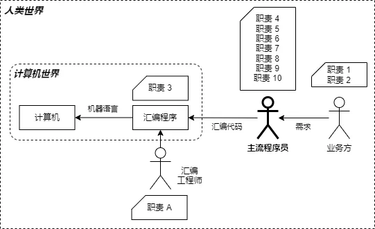
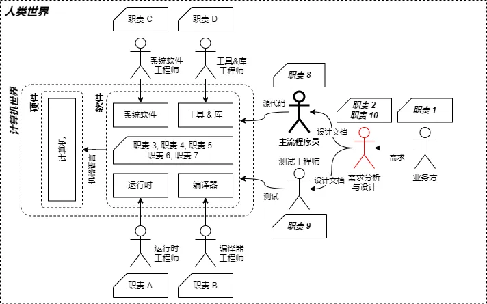
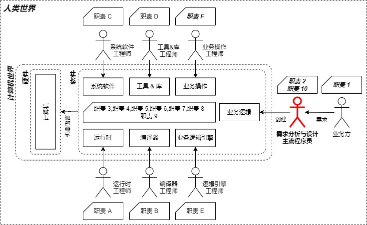
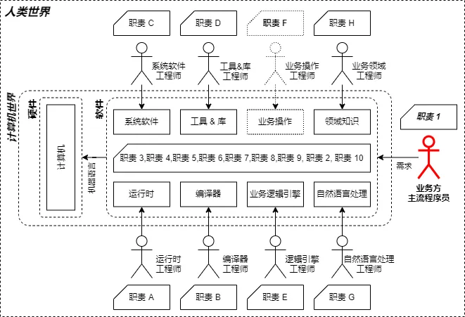

# BOP概述

## 引言

BOP（Business-Oriented Programming 面向业务编程）作为一种前沿的编程理念，旨在通过提供灵活、低成本、高效能的IT系统，助力企业实现业务逻辑的快速迭代与系统维护。BOP的诞生，源于对软件行业长期存在问题的深刻反思，特别是在业务系统开发与维护领域。尽管传统编程方法在技术层面取得了显著进展，但在应对复杂多变的业务需求时，往往显得捉襟见肘。BOP通过引入创新的编程理念与工具，致力于解决这些难题，推动软件行业迈向更高效、更灵活的发展轨道。

## BOP的核心概念

BOP的核心理念在于将业务逻辑与底层技术实现进行分离，并提供可量化的分离标准与算法。通过结构化的业务描述模型和高效的执行引擎，BOP实现了业务逻辑的快速调整与系统的高效运行，同时实现了业务系统内部信息的白盒化，显著提升了业务系统的信息可管理性与可维护性。

### 业务描述模型

作为BOP的核心组件之一，业务描述模型用于在业务无关性标准下对业务系统进行建模。该模型能够满足各行业领域的业务数据处理流程描述需求。其核心在于业务逻辑分离算法的定义，确保代码中的逻辑部分与业务处理部分实现有效分离。

### 流程图聚合算法

基于业务描述模型，流程图聚合算法对模型形成的业务处理流程所对应的有向图进行分析，自动聚合相关操作。这使得流程图能够进行自动聚合与展开，将复杂的业务流程进行合理抽象，在有限的屏幕空间中输出更具代表性的工作节点信息。

### 业务执行引擎

业务执行引擎是BOP的另一核心组件，它以业务描述模型的输出结果为基础，精确执行预定的业务逻辑与基础业务操作。执行引擎实现了程序代码与设计文档的实时同步，并确保程序实现与设计文档的100%匹配，从而实现0逻辑性bug的目标。

## 回顾软件编码行业演进

自20世纪50年代以来，软件编码行业经历了多次显著的技术变革与行业危机。通过对这些历史事件的重新分析与解读，我们能更好地理解BOP提出的背景与意义。本文选取了主流程序员职责视角，从一个全新的角度，以统一的标准探讨了软件编码行业的演进历程，从而为软件编码行业的进一步发展奠定了理论基础。

### 20世纪40-50年代初期：机器码时代

在电子计算机诞生的初期，主流程序员主要是直接创造计算机硬件的科学家们。他们普遍具有数学、物理学等学科的博士学位，所使用的编程语言是由二进制构成的机器语言。这些程序员需要将业务需求直接转换为二进制机器语言，工作内容繁重且复杂。

### 20世纪50-60年代初期：汇编时代

随着汇编程序的出现，主流程序员可以直接使用由硬件厂商提供的汇编程序进行程序创作。汇编程序工程师负责为CPU编写进行助记符映射的专用软件，而主流程序员此时显然可以不用操心对应的映射过程。任务分工的出现使得更少的人为更多的人提供基础工具，经过完整测试的工具，能精确可信地完成预期的工作任务。主流程序员所需要学习的知识领域被收缩，承担的职责数量降低。主流程序员从而可以完成更多的工作量。

### 20世纪60年代至今：高级语言与软件工程

我们认为解决第一次软件危机的主要工具是高级语言的诞生，而第二次软件危机的解决主要是面向对象带来的IT基础结构软件的出现。高级语言进一步抽象了编码结果的业务抽象层次，使得主流程序员进一步远离硬件和操作系统，更专注表达业务概念。我们选取了具有代表性的模块来展示这个时代的特征。

1. **编译器**：高级语言主要以编译语言为主。高级语言进一步抽象了编码结果的业务抽象层次，使得主流程序员进一步远离硬件和操作系统，更专注表达业务概念，虽然实际上主要是在表达数据处理概念。
2. **运行时**：运行时通常包含解释器，同时运行时也是更现代的高级语言所拥有的一种特征。运行时进一步隔离了很多基础的编程细节，例如指针操作，垃圾回收以及边界检查等。
3. **工具和库**：图形中的工具和库类型，主要指在源代码中引用的那些包含通用算法或特定功能的外部库。以及用于辅助主流程序员开发工作的效率工具，例如IDE，调试工具等。
4. **系统软件**：系统软件其实包含了很多方面，例如硬件驱动程序以及部分工具其实也是系统软件。我们并没有在图形中完整表达所有组成部分。在这个图形中，系统软件更强调IT基础服务，例如数据库、缓存、队列，网络服务器等基础结构软件。

高级语言的出现使得主流程序员彻底摆脱了和CPU密切关联的助记符。并且借助编译器的跨平台能力，高级语言可以在更多不同类型的CPU上得以运行。源代码中所包含的信息以及主流程序员所必须要学习的知识都被重新定义。一个不知道如何操作指针的主流程序员，完全可以成为全世界最优秀的程序员之一。

运行时和编译器为主流程序员提供的更为语义化的高级语言。主流程序员的思考重心从如何有效控制寄存器、控制指针、设计巧妙的数据结构，转变成了大部分时间之需要专注业务数据的处理逻辑，进行各种数据集合运算进行合理的IO和业务异常处理。

而系统软件以及工具和库的大爆发显然得益于同期的面向对象和设计模式带来的强有力的帮助。大量的IT基础设施被标准化，使得主流程序员进一步摆脱这些可以跨项目复用的软件功能。

主流程序员所承担的职责显著下降了超过50%以上。无论对于一个人成为程序员的入门难度，还是一个程序员每天工作时间的最终业务相关的代码产出量，都是极大的提升。这是第二次软件危机被解决的最重要的一个因素。

一个没有纳入图形的因素是在2010年以后大放异彩的SaaS/CI/CD技术。这些技术对于提升软件团队的迭代速度有着显著的贡献。但是由于其对于主流程序员视角下的职责变化影响不大，因此没有被体现在图形中。

接下来要谈到的是一个其实从60年代就被引入的概念，那就是软件工程。其中最主要的是需求分析与设计的职责。我们可以从下图看到其所在的位置。软件工程事实上对于软件项目的开发起到了非常有效的促进和规范的作用。同时进一步的分工使得主流程序员所承担的职责进一步下降。

到这里我们可以很清晰的从历史发展的轨迹中看到主流程序员所承担的职责是如何逐步随着软件编程语言的发展、编程工具的发展、软件工程的完善，逐渐从一个人承担所有的工作，转变到每个岗位的分工协作。同时对于右侧的4个岗位，我们加粗了其职责，用于表达这4个岗位针对目标商业项目的实际业务逻辑具有深度的理解。而左侧的4个岗位只负责承担公共基础模块的维护，并不直接面对最终项目的业务需求。

通过从主流程序员视角回顾软件编码行业的历史发展过程，我们可以透过多次软件危机的表面现象，看到一个更为本质的规律。那就是主流程序员的职责被持续地分解。主流程序员的工作从独立完成一切，转变到了受到大量第三方提供的、被良好测试、可信的基础组件所支持。一个人类所能完成的工作复杂度显然是有上限的。分工可以降低每个个体的工作复杂度。良好的工具同样能降低实际的工作复杂度。随着强有力的工具支持，主流程序员的知识结构也在持续改变。更多的人有可能成为主流程序员而不是必须拥有PhD学位。这对于整个编码行业的发展显然有极大的促进意义。

现在让我们结合软件编码行业的问题继续来审查这个图形。一个明显的核心岗位就是需求分析与设计岗位。目前没有任何一个大学或者企业，提供一份需求文档最小信息集合的定义。从软件编码行业出现至今，我们没有任何可量化可重复执行的需求文档的审查评估标准，以确保需求文档所描述信息的完整性。我们实际上依赖在最终实现阶段的快速反馈和迭代来逐步完善可能缺失部分信息的需求文档。从理论上我们没有任何可信的方法，在没有进行实际代码实现以前发现文档中未发现的问题。并且基于现有的软件工程学的流程定义，有关需求问题的报告、反馈以及相关信息在一定范围内的同步都会引发更多的沟通和传播成本。我们都知道越早发现问题成本越低，但是我们事实上没有任何科学的方法实现这个目的。软件编码行业实际上存在更多类似需求文档这样的“我们应当这么做，但是我们事实上不愿意这么做”的问题。

在当前这个状态下，基于大量类似软件需求分析与设计这样的问题存在，且长期没有有效的解决方案。我们可以看到程序员的职责范围已经非常有限，困扰软件编码效率提升的瓶颈应该不是编码工具和基础组件，而是软件工程理论本身。如何进一步协调这些工作以降低成本，如何使得最终项目开发的实际工作量进一步下降，是如今数字化运营对于软件编码行业的一个迫切的要求。

## 行业问题

### 普遍存在的问题

软件编码行业存在许多尚未解决的问题，这些问题或大或小，出现时间或早或晚。例如以下是一些在软件编码行业中普遍存在，但在其他行业中较为罕见的问题类型：

1. **UML的使用率低**：UML（统一建模语言）自1997年诞生以来，被认为是一个非常优秀的工具。然而，在整体软件编码行业中，UML的实际使用率估计很难超过10%。大多数程序员虽然不会公开声称UML无用，但在实际工作中很少努力扩大其使用频率。

2. **TDD和DDD的普及率低**：测试驱动开发（TDD）和领域驱动设计（DDD）大约诞生于2002-2003年，被公认为是非常优秀的软件开发模式。然而，在整体软件编码行业中，TDD和DDD的实际使用率估计很难超过10%。大多数程序员虽然不会公开声称它们无用，但在实际工作中很少努力扩大其使用频率。

3. **需求文档的不完善**：软件需求分析和需求文档的历史几乎和软件编码一样长。然而，需求分析和需求文档对于大多数程序员而言，是一个不公开声称它无用，但从来不会在实际工作中努力编写100%完善的文档。

### 具体问题分析

1. **函数长度与代码规范**：一个函数究竟应该写多长或多短？即使我们有大量的编码规范，即使我们仅使用同一种编码语言的规范，我们也很难找到一个统一的版本。我们有大量的IDE工具，提供设计时语法分析，甚至是代码规范分析。但是一个函数应该写多长除了总行数和代码逻辑复杂度指标以外并没有任何可以被算法化、自动化的理论。

2. **需求文档的完整性**：需求文档必须包含哪些信息才算合格？如何评估需求文档的完整度？答案大概率是没有。虽然我们可以解释说需求很难一次性描述完整。但是你面前这份需求文档里，是否存在重大逻辑错误或遗漏这个问题，是否存在可算法化的工具辅助进行分析？答案显然是没有，这意味着事实上需求文档不存在严格的内容约束。这足以解释为什么软件开发是一个不可复现的过程。因为从一开始，起点就是一个不固定的，基于概率和运气的东西。

3. **编程能力的代际传承**：当不存在可快速学习的理论知识时，编程能力仅仅是一种个人经验的积累，而经验的代际传承效率是很低的。从1950年至今，支撑软件编码行业快速发展，其中程序员的总人数发展速度保持了非常高的年化速度。我们无法确定未来软件行业的总人数依然会持续快速上升。同时整体行业人数的上升必然导致平均能力的下降。我们可以确信的是50年后每年的信息处理总需求量显著会大于2024年，我们正处于软件危机之中。

### 共性与出路

上述问题的共性是一方面一些理论和模式被大家承认呢，但同时却几十年长期在工程实践中被主动放弃。软件编码行业面临着诸多挑战，从工具的使用率低到需求文档的不完善，再到编程能力的代际传承问题。这些问题不仅影响了软件开发的效率和质量，也限制了行业的进一步发展。BOP的提出，正是为了解决这些长期存在的问题，通过提供更为灵活、更低学习成本和维护成本的IT系统，帮助企业实现业务逻辑的快速迭代和系统维护。

## 低代码/无代码与工作流

### 数字化运营的压力与解决方案

随着数字化运营的普及，企业对IT系统的需求发生了显著变化。传统的软件开发模式在应对快速变化的业务需求时显得力不从心。为了解决这一问题，软件编码行业提出了多种解决方案，其中包括低代码/无代码平台和工作流技术。

### 低代码/无代码平台的困境

低代码/无代码平台自2015年左右开始兴起，旨在通过可视化编程和预构建组件，帮助非技术人员快速构建应用程序。这些平台通过限制最终用户只能在平台提供的能力范围内进行操作，从而实现相对传统编码方式更高效的生产力。

然而，低代码/无代码平台的扩展性受到限制。一旦最终用户的业务模型发生变更，平台本身的扩展性就会受到挑战。最终用户如果没有足够的技术力量去维护低代码/无代码平台，就会逐渐被平台限制了业务的变化能力。

### 工作流技术的局限性

工作流技术历史更为悠久，旨在通过图形化的方式展示和控制业务流程。每个工作流节点代表一个业务操作，节点之间的连接表示业务流程的逻辑顺序。

工作流技术的主要问题在于，当节点的复杂度过高且没有及时细分时，工作流的意义变低。而当节点划分过细，以图形方式表达业务逻辑的信息密度就过低。一个有50个节点的工作流可能需要一个100英寸的显示器，最终用户的体验非常糟糕。工作流更多被用于较为高层的业务逻辑可视化管理，而不会针对单个函数内部的代码执行流程进行管理。

### BOP促进相关领域的前进

尽管低代码/无代码平台和工作流技术在一定程度上解决了部分问题，但它们并没有真正解决软件编码行业面临的根本挑战。低代码/无代码平台的扩展性问题和工作流技术的复杂性问题，使得这些解决方案在实际应用中仍然存在诸多限制。BOP（面向业务编程）的提出，正是为了解决这些长期存在的问题，通过提供更为灵活、更低学习成本和维护成本的IT系统，帮助企业实现业务逻辑的快速迭代和系统维护。

## BOP带来的变化

引入BOP以后，我们可以进一步通过图形的变化来观察可能的变化：

1. **主流程序员角色和分析与设计角色重合**

   在BOP模型中，主流程序员角色和分析与设计角色逐渐重合。分析与设计人员可以更为自由、自主得进行业务逻辑的设计和表达，减少了沟通环节，加速设计反馈。业务操作工程师虽然也是原有主流程序员的一个分化结果，但其职责与业务逻辑变更的关系已经降低了很多。此时，原先对于业务逻辑进行分析和定义的角色就逐渐成为了主流程序员。

2. **测试工作被简化**

   原有的测试角色从图形中消失了，但这并不意味着不需要测试。和图形中系统软件、编译器等分支那样，每个分支必然存在其自身的测试过程。不过基于BOP的理论，测试工作的确被大幅度简化了。业务逻辑理论上不需要任何测试，因为业务逻辑引擎100%确保业务逻辑的执行过程和结果完全匹配业务逻辑的设计文档。这就和目前编译器的输出结果100%符合源代码设计逻辑是一样的。BOP实现了将传统实现阶段的人为疏忽和需求理解歧义导致的Bug数量下降为0的目标。不仅不需要单元测试，也不需要集成测试，甚至不存在回归测试。基于BOP模型，这些测试都是无意义的。

   真正有意义的是在进行编码前对于业务逻辑本身的逻辑完整性与合理性的验证。在业务逻辑被表达后，可以使用各种验证工具和方法对业务逻辑进行全方位的审查和验证，从而实现在设计初期发现更多设计上的潜在问题的目标。项目开发的时间分配，可以削减更多测试与开发的时间，转而增加更多需求分析与设计的时间。最终用整体上更少的时间，提交文档完整，逻辑完整的高质量的商业业务信息处理系统。这种验证在行业内其实一直存在，那就是软件的静态形式化验证。BOP将努力推动形式化验证的普及，更低成本以及在需求分析与设计阶段就引入形式化验证的能力。

## BOP的规范

### 更多编码限制

如果不禁止直接使用goto, 就不会有更加清晰简洁的结构化编码语言。如果不禁止直接使用指针，就不会有更加强壮的现代编码语言。软件编码行业的每一次重大发展，都伴随着针对程序员编码能力的限制。多数现代程序员可能无法想象直接用机器码编写一个加法所需要的机器语言代码量和目前任何高级语言完成对应功能所需要执行的机器语言代码量的差异。用更多的最终执行代码、更慢的整体执行速度，才能获得更具有业务抽象意义的程序源代码。

### 业务逻辑分离

业务逻辑分离是软件编码行业长期以来的一个目标。然而，由于缺乏明确的执行标准，因此也不存在任何辅助工具进行验证。最终使得大部分中小型项目在各种现实压力下几乎完全靠程序员的个人专业能力进行业务逻辑分离抽象的工作，且几乎没有任何有效审核。

基础业务操作的定义，是对于一个特定的业务系统，那些不带有任何业务判断的IO操作，外部库调用等等，都可以认为是一种原子的，基础的，具有业务意义的操作。因此在有效识别基础业务操作之后，剩下的代码95%以上都是业务逻辑代码。一个系统中的业务逻辑可能每天都会被改变，但是基础业务操作的变更频率会低很多。并且基础业务操作的变更原因往往和业务逻辑变更无关。

当我们有效识别出业务逻辑，并将业务逻辑文档化，结构化方式进行存储和表达后，整个系统的业务逻辑就会清晰得呈现在使用者面前。使用者可以通过各种查询手段快速获得当前系统内的各种信息。比如某个函数被使用的次数，某个业务数据被使用的位置。甚至可以实现对整个系统代码的静态形式化验证。这显然能以更低的成本，将很多百年一遇的极端场景造成的损失消灭在萌芽状态。虽然这些数据目前可以在有些IDE上被提供。但是产品经理同样非常需要这些数据，他们迫切想知道某个业务数据的定义变更会影响到多少业务流程。BOP能提供一个信息系统自身元数据的管理系统满足这些需求。

### 文档先行

当使用BOP模型对商业系统进行分析后，会形成大量比传统需求分析更细致的分析结果。使得在实际代码开发前就能有效通过算法工具来评估现有需求的逻辑完整性，从而将在项目初期就有效识别项目风险这个软件工程中的梦想成为现实。

BOP模型强调文档，并且是结构化/半结构化的文档。基于BOP模型构建的项目，拥有和项目完全同步的设计文档。实时上BOP强调的是现有文档后有代码实现。这个趋势在目前LLM的大规模应用中已经被很多程序员所感受-代码只是文档描述的输出结果。对于大型商业系统的业务程序员而言，BOP的建议是只写文档，不写代码。

## BOP的愿景

### 多系统集成

一个独立的BOP系统对于使用该系统的商业企业具有极大的收益。但是BOP的目标不仅于此。BOP实现了业务逻辑和业务处理的有效分离，使得系统解耦得到了有效的保障。因此不同系统的集成和替换就变得更为轻松。尤其当多个遵守BOP理论的系统进行集成时，基于文档先行的标准，系统集成的质量在一开始就远远高于任何现有的模式。因为两个系统的输入输出具有完全可信的文档作为起点。

### 系统重写

一个最新的软件危机是大量的历史系统的维护成本高昂到了无法理解的地步。企业甚至愿意接受在没有完整测试并承担业务风险的前提下重新开发系统并逐步替换原系统。现有的工具对于从代码识别完整业务逻辑的支持并不理想。同时新开发的系统依然存在这样的潜在技术维护问题，问题只是被再一次延期，一个未来的或有成本指出需要在财务账面上被标记。

基于BOP的系统能提供详细和准确的业务逻辑描述。无论是利用自动化编码工具进行重新实现，还是使用者这些描述进行完全功能覆盖的测试，都可以有可信的基础文档。这将会使得IT系统的维护成本更透明，更可控。

### BOP与4GL和NLP

伴随着LLM的不断成熟，自然语言处理的能力使得最终用户已经可以较为自由得和应用系统进行交互。在自然语言处理模块和针对特定领域的领域知识的辅助下，我们可以进一步设想BOP模型的未来变化。

此时出现了一个最大的变化，那就是主流程序员这个定义的消失。其实事实上这是“人人都是程序员”的一个实现的途径。需求将从业务方，用自然语言交互的方式直接进入软件系统。彻底改变现有的软件开发模式，将沟通成本从理论上下降到了最低。

另一个可能的变化，则是业务操作工程师的角色可能会消失。当BOP所推荐的编码模式被接受，基础业务操作本身所具有的业务含义已经被相关文档完整描述。实现一个数据访问层并不是一个需要深度业务理解的工作。很多系统的IO都可以基于标准化的SDK、provider或client完成。基于大语言模型的模块级别的源代码自动生成已经处于工业化的边缘。我们需要的很可能仅仅是一个工业化的规范，例如BOP规范。

第四代编码语言一直是软件编码行业的长期课题。BOP实现了目标业务领域无关的描述模型，是一种商业业务流程描述模型。如同SQL针对的是数据关系以及查询领域，BOP可以衍生出商业业务处理流程的统一描述标准。在面向对象时代的抽象往往是抽象出更具体的实现。各种DSL也是面对实际的领域而不是更为泛化的编码或程序处理流程本身。因此当我们从程序执行本身领域进行抽象，得到一个与具体软件项目领域无关的元数据描述时，我们就自然能得到一个通用的，能表达程序处理流程的语言。这很可能就是编码领域的一个第四代编码语言。SQL描述的是数据结构与操作，而BOP描述的是数据处理流程。

自然语言编程同样是一个长期的梦想。目前自然语言理解用于LLM的突破已经称为了现实。当前的大语言模型完全能识别自然语言的描述并输出对应的程序员代码。但是一个困扰的问题是对于大型模块，对于整体项目而言大模型的效果并不理想。从BOP角度来分析，这并不是大模型的能力不足，而是我们无法用自然自然语言更准确得描述实际的编码意图。同时自然语言所固有的很多缺陷使得它并不适合直接作为对更为大规模的逻辑进行描述的工具。从自然语言到高级语言源代码之间如果加入一个中间层，显然会指数级降低从自然语言到源代码生成过程的难度。而BOP作为一个流程描述工具，可以在其中完成核心的元数据承载工作。

## 总结

我们回顾软件编码行业的历史，从主流程序员的职责变化解析了一种可能的发展趋势和模式。从商业软件的发展趋势指出未来企业用户的核心需求会转移到对自身商业逻辑的低成本快速迭代，对IT系统的低成本维护，高质量的文档，以及IT系统内部的业务信息能被除了IT部门程序员以外，包括但不限于产品经理、业务经理、公司中高层等任何关心相关业务的岗位和人员轻松的访问。

BOP可以构建对非IT人员友好的业务流程信息管理系统。使得软件编码行业的主流程序员进一步远离底层实现技术，使得更多的人成为新的主流程序员，使得主流程序员与实际商业业务的结合更为深度。最终推进自然语言编程与第4代通用编码语言的实现过程。
