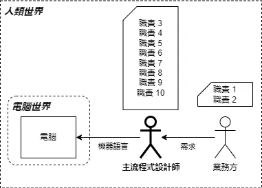
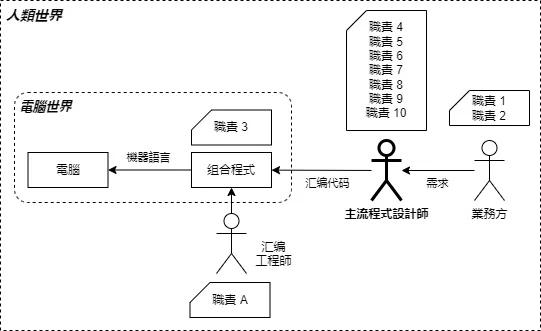
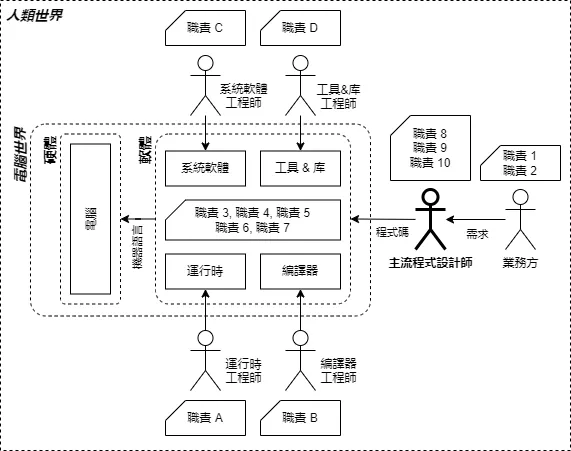
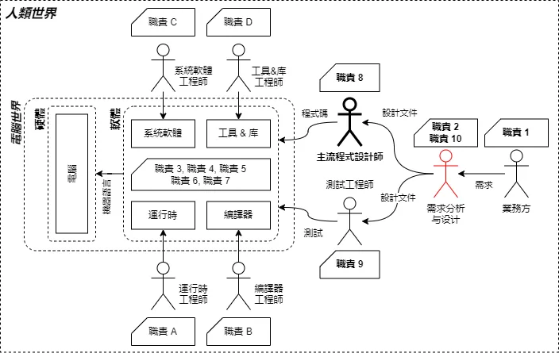
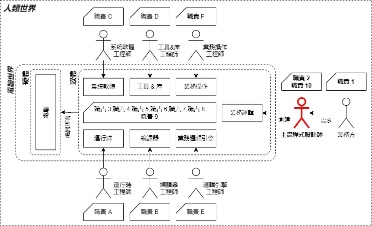
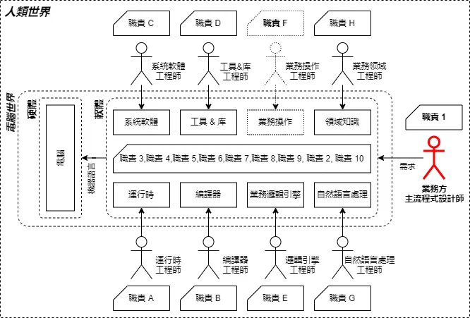

# BOP概述

## 引言

BOP（面向業務編程）作為一種前沿的編程理念，旨在通過提供靈活、低成本、高效能的IT系統，助力企業實現業務邏輯的快速迭代與系統維護。BOP的誕生，源於對軟體行業長期存在問題的深刻反思，特別是在業務系統開發與維護領域。儘管傳統編程方法在技術層面取得了顯著進展，但在應對複雜多變的業務需求時，往往顯得捉襟見肘。BOP通過引入創新的編程理念與工具，致力於解決這些難題，推動軟體行業邁向更高效、更靈活的發展軌道。

## BOP的核心概念

BOP的核心理念在於將業務邏輯與底層技術實現進行分離，並提供可量化的分離標準與算法。通過結構化的業務描述模型和高效的執行引擎，BOP實現了業務邏輯的快速調整與系統的高效運行，同時實現了業務系統內部信息的白盒化，顯著提升了業務系統的信息可管理性與可維護性。

### 業務描述模型

作為BOP的核心組件之一，業務描述模型用於在業務無關性標準下對業務系統進行建模。該模型能夠滿足各行業領域的業務數據處理流程描述需求。其核心在於業務邏輯分離算法的定義，確保代碼中的邏輯部分與業務處理部分實現有效分離。

### 流程圖聚合算法

基於業務描述模型，流程圖聚合算法對模型形成的業務處理流程所對應的有向圖進行分析，自動聚合相關操作。這使得流程圖能夠進行自動聚合與展開，將複雜的業務流程進行合理抽象，在有限的屏幕空間中輸出更具代表性的工作節點信息。

### 業務執行引擎

業務執行引擎是BOP的另一核心組件，它以業務描述模型的輸出結果為基礎，精確執行預定的業務邏輯與基礎業務操作。執行引擎實現了程序代碼與設計文檔的即時同步，並確保程序實現與設計文檔的100%匹配，從而實現0邏輯性bug的目標。

## 回顧軟體編碼行業演進

自20世紀50年代以來，軟體編碼行業經歷了多次顯著的技術變革與行業危機。通過對這些歷史事件的重新分析與解讀，我們能更好地理解BOP提出的背景與意義。本文選取了主流程式員職責視角，從一個全新的角度，以統一的標準探討了軟體編碼行業的演進歷程，從而為軟體編碼行業的進一步發展奠定了理論基礎。

### 20世紀40-50年代初期：機器碼時代

在電子計算機誕生的初期，主流程式員主要是直接創造計算機硬體的科學家們。他們普遍具有數學、物理學等學科的博士學位，所使用的編程語言是由二進制構成的機器語言。這些程式員需要將業務需求直接轉換為二進制機器語言，工作內容繁重且複雜。

### 20世紀50-60年代初期：組合語言時代

隨著組合語言程式的出現，主流程式員可以直接使用由硬體廠商提供的組合語言程式進行程式創作。組合語言工程師負責為CPU編寫進行助記符映射的專用軟體，而主流程式員此時顯然可以不用操心對應的映射過程。任務分工的出現使得更少的人為更多的人提供基礎工具，經過完整測試的工具，能精確可信地完成預期的工作任務。主流程式員所需要學習的知識領域被收縮，承擔的職責數量降低。主流程式員從而可以完成更多的工作量。

### 20世紀60年代至今：高階語言與軟體工程

我們認為解決第一次軟體危機的主要工具是高階語言的誕生，而第二次軟體危機的解決主要是面向對象帶來的IT基礎結構軟體的出現。高階語言進一步抽象了編碼結果的業務抽象層次，使得主流程式員進一步遠離硬體和作業系統，更專注表達業務概念。我們選取了具有代表性的模組來展示這個時代的特徵。

1. **編譯器**：高階語言主要以編譯語言為主。高階語言進一步抽象了編碼結果的業務抽象層次，使得主流程式員進一步遠離硬體和作業系統，更專注表達業務概念，雖然實際上主要是在表達數據處理概念。
2. **運行時**：運行時通常包含解釋器，同時運行時也是更現代的高階語言所擁有的一種特徵。運行時進一步隔離了很多基礎的編程細節，例如指標操作，垃圾回收以及邊界檢查等。
3. **工具和庫**：圖形中的工具和庫類型，主要指在源代碼中引用的那些包含通用算法或特定功能的外部庫。以及用於輔助主流程式員開發工作的效率工具，例如IDE，調試工具等。
4. **系統軟體**：系統軟體其實包含了很多方面，例如硬體驅動程式以及部分工具其實也是系統軟體。我們並沒有在圖形中完整表達所有組成部分。在這個圖形中，系統軟體更強調IT基礎服務，例如資料庫、緩存、隊列，網路伺服器等基礎結構軟體。

高階語言的出現使得主流程式員徹底擺脫了和CPU密切關聯的助記符。並且借助編譯器的跨平台能力，高階語言可以在更多不同類型的CPU上得以運行。源代碼中所包含的信息以及主流程式員所必須要學習的知識都被重新定義。一個不知道如何操作指標的主流程式員，完全可以成為全世界最優秀的程式員之一。

運行時和編譯器為主流程式員提供的更為語義化的高階語言。主流程式員的思考重心從如何有效控制暫存器、控制指標、設計巧妙的數據結構，轉變成了大部分時間只需要專注業務數據的處理邏輯，進行各種數據集合運算進行合理的IO和業務異常處理。

而系統軟體以及工具和庫的大爆發顯然得益於同期的面向對象和設計模式帶來的強有力的幫助。大量的IT基礎設施被標準化，使得主流程式員進一步擺脫這些可以跨項目復用的軟體功能。

主流程式員所承擔的職責顯著下降了超過50%以上。無論對於一個人成為程式員的入門難度，還是一個程式員每天工作時間的最終業務相關的代碼產出量，都是極大的提升。這是第二次軟體危機被解決的最重要的因素。

一個沒有納入圖形的因素是在2010年以後大放異彩的SaaS/CI/CD技術。這些技術對於提升軟體團隊的迭代速度有著顯著的貢獻。但是由於其對於主流程式員視角下的職責變化影響不大，因此沒有被體現在圖形中。

接下來要談到的是一個其實從60年代就被引入的概念，那就是軟體工程。其中最主要的是需求分析與設計的職責。我們可以從下圖看到其所在的位置。軟體工程事實上對於軟體項目的開發起到了非常有效的促進和規範的作用。同時進一步的分工使得主流程式員所承擔的職責進一步下降。

到這裡我們可以很清晰的從歷史發展的軌跡中看到主流程式員所承擔的職責是如何逐步隨著軟體編程語言的發展、編程工具的發展、軟體工程的完善，逐漸從一個人承擔所有的工作，轉變到每個崗位的分工協作。同時對於右側的4個崗位，我們加粗了其職責，用於表達這4個崗位針對目標商業項目的實際業務邏輯具有深度的理解。而左側的4個崗位只負責承擔公共基礎模組的維護，並不直接面對最終項目的業務需求。

通過從主流程式員視角回顧軟體編碼行業的歷史發展過程，我們可以透過多次軟體危機的表面現象，看到一個更為本質的規律。那就是主流程式員的職責被持續地分解。主流程式員的工作從獨立完成一切，轉變到了受到大量第三方提供的、被良好測試、可信的基礎組件所支持。一個人類所能完成的工作複雜度顯然是有上限的。分工可以降低每個個體的工作複雜度。良好的工具同樣能降低實際的工作複雜度。隨著強有力的工具支持，主流程式員的知識結構也在持續改變。更多的人有可能成為主流程式員而不是必須擁有PhD學位。這對於整個編碼行業的發展顯然有極大的促進意義。

現在讓我們結合軟體編碼行業的問題繼續來審查這個圖形。一個明顯的核心崗位就是需求分析與設計崗位。目前沒有任何一個大學或者企業，提供一份需求文檔最小信息集合的定義。從軟體編碼行業出現至今，我們沒有任何可量化可重複執行的需求文檔的審查評估標準，以確保需求文檔所描述信息的完整性。我們實際上依賴在最終實現階段的快速反饋和迭代來逐步完善可能缺失部分信息的需求文檔。從理論上我們沒有任何可信的方法，在沒有進行實際代碼實現以前發現文檔中未發現的問題。並且基於現有的軟體工程學的流程定義，有關需求問題的報告、反饋以及相關信息在一定範圍內的同步都會引發更多的溝通和傳播成本。我們都知道越早發現問題成本越低，但是我們實際上沒有任何科學的方法實現這個目的。軟體編碼行業實際上存在更多類似需求文檔這樣的“我們應當這麼做，但是我們實際上不願意這麼做”的問題。

在當前這個狀態下，基於大量類似軟體需求分析與設計這樣的問題存在，且長期沒有有效的解決方案。我們可以看到程式員的職責範圍已經非常有限，困擾軟體編碼效率提升的瓶頸應該不是編碼工具和基礎組件，而是軟體工程理論本身。如何進一步協調這些工作以降低成本，如何使得最終項目開發的實際工作量進一步下降，是如今數位化運營對於軟體編碼行業的一個迫切的要求。

## 行業問題

### 普遍存在的問題

軟體編碼行業存在許多尚未解決的問題，這些問題或大或小，出現時間或早或晚。例如以下是一些在軟體編碼行業中普遍存在，但在其他行業中較為罕見的問題類型：

1. **UML的使用率低**：UML（統一建模語言）自1997年誕生以來，被認為是一個非常優秀的工具。然而，在整體軟體編碼行業中，UML的實際使用率估計很難超過10%。大多數程式員雖然不會公開聲稱UML無用，但在實際工作中很少努力擴大其使用頻率。

2. **TDD和DDD的普及率低**：測試驅動開發（TDD）和領域驅動設計（DDD）大約誕生於2002-2003年，被公認為是非常優秀的軟體開發模式。然而，在整體軟體編碼行業中，TDD和DDD的實際使用率估計很難超過10%。大多數程式員雖然不會公開聲稱它們無用，但在實際工作中很少努力擴大其使用頻率。

3. **需求文檔的不完善**：軟體需求分析和需求文檔的歷史幾乎和軟體編碼一樣長。然而，需求分析和需求文檔對於大多數程式員而言，是一個不公開聲稱它無用，但從來不會在實際工作中努力編寫100%完善的文檔。

### 具體問題分析

1. **函數長度與代碼規範**：一個函數究竟應該寫多長或多短？即使我們有大量的編碼規範，即使我們僅使用同一種編碼語言的規範，我們也很難找到一個統一的版本。我們有大量的IDE工具，提供設計時語法分析，甚至是代碼規範分析。但是一個函數應該寫多長除了總行數和代碼邏輯複雜度指標以外並沒有任何可以被算法化、自動化的理論。

2. **需求文檔的完整性**：需求文檔必須包含哪些信息才算合格？如何評估需求文檔的完整度？答案大概率是沒有。雖然我們可以解釋說需求很難一次性描述完整。但是你面前這份需求文檔裡，是否存在重大邏輯錯誤或遺漏這個問題，是否存在可算法化的工具輔助進行分析？答案顯然是沒有，這意味著事實上需求文檔不存在嚴格的內容約束。這足以解釋為什麼軟體開發是一個不可復現的過程。因為從一開始，起點就是一個不固定的，基於概率和運氣的東西。

3. **編程能力的代際傳承**：當不存在可快速學習的理論知識時，編程能力僅僅是一種個人經驗的積累，而經驗的代際傳承效率是很低的。從1950年至今，支撐軟體編碼行業快速發展，其中程式員的總人數發展速度保持了非常高的年化速度。我們無法確定未來軟體行業的總人數依然會持續快速上升。同時整體行業人數的上升必然導致平均能力的下降。我們可以確信的是50年後每年的信息處理總需求量顯著會大於2024年，我們正處於軟體危機之中。

### 共性與出路

上述問題的共性是一方面一些理論和模式被大家承認呢，但同時卻幾十年長期在工程實踐中被主動放棄。軟體編碼行業面臨著諸多挑戰，從工具的使用率低到需求文檔的不完善，再到編程能力的代際傳承問題。這些問題不僅影響了軟體開發的效率和質量，也限制了行業的進一步發展。BOP的提出，正是為了解決這些長期存在的問題，通過提供更為靈活、更低學習成本和維護成本的IT系統，幫助企業實現業務邏輯的快速迭代和系統維護。

## 低代碼/無代碼與工作流

### 數位化運營的壓力與解決方案

隨著數位化運營的普及，企業對IT系統的需求發生了顯著變化。傳統的軟體開發模式在應對快速變化的業務需求時顯得力不從心。為了解決這一問題，軟體編碼行業提出了多種解決方案，其中包括低代碼/無代碼平台和工作流技術。

### 低代碼/無代碼平台的困境

低代碼/無代碼平台自2015年左右開始興起，旨在通過可視化編程和預構建組件，幫助非技術人員快速構建應用程序。這些平台通過限制最終用戶只能在平台提供的能力範圍內進行操作，從而實現相對傳統編碼方式更高效的生产力。

然而，低代碼/無代碼平台的擴展性受到限制。一旦最終用戶的業務模型發生變更，平台本身的擴展性就會受到挑戰。最終用戶如果沒有足夠的技術力量去維護低代碼/無代碼平台，就會逐漸被平台限制了業務的變化能力。

### 工作流技術的局限性

工作流技術歷史更為悠久，旨在通過圖形化的方式展示和控制業務流程。每個工作流節點代表一個業務操作，節點之間的連接表示業務流程的邏輯順序。

工作流技術的主要問題在於，當節點的複雜度過高且沒有及時細分時，工作流的意义變低。而當節點劃分過細，以圖形方式表達業務邏輯的信息密度就過低。一個有50個節點的工作流可能需要一個100英寸的顯示器，最終用戶的體驗非常糟糕。工作流更多被用於較為高層的業務邏輯可視化管理，而不會針對單個函數內部的代碼執行流程進行管理。

### BOP促進相關領域的前進

儘管低代碼/無代碼平台和工作流技術在一定程度上解決了部分問題，但它們並沒有真正解決軟體編碼行業面臨的根本挑戰。低代碼/無代碼平台的擴展性問題和工作流技術的複雜性問題，使得這些解決方案在實際應用中仍然存在諸多限制。BOP（面向業務編程）的提出，正是為了解決這些長期存在的問題，通過提供更為靈活、更低學習成本和維護成本的IT系統，幫助企業實現業務邏輯的快速迭代和系統維護。

## BOP帶來的變化

引入BOP以後，我們可以進一步通過圖形的變化來觀察可能的變化：

1. **主流程式員角色和分析與設計角色重合**

   在BOP模型中，主流程式員角色和分析與設計角色逐漸重合。分析與設計人員可以更為自由、自主地進行業務邏輯的設計和表達，減少了溝通環節，加速設計反饋。業務操作工程師雖然也是原有主流程式員的一個分化結果，但其職責與業務邏輯變更的關係已經降低了很多。此時，原先對於業務邏輯進行分析和定義的角色就逐漸成為了主流程式員。

2. **測試工作被簡化**

   原有的測試角色從圖形中消失了，但這並不意味著不需要測試。和圖形中系統軟體、編譯器等分支那樣，每個分支必然存在其自身的測試過程。不過基於BOP的理論，測試工作的確被大幅度簡化了。業務邏輯理論上不需要任何測試，因為業務邏輯引擎100%確保業務邏輯的執行過程和結果完全匹配業務邏輯的設計文檔。這就和目前編譯器的輸出結果100%符合源代碼設計邏輯是一樣的。BOP實現了將傳統實現階段的人為疏忽和需求理解歧義導致的Bug數量下降為0的目標。不僅不需要單元測試，也不需要集成測試，甚至不存在回歸測試。基於BOP模型，這些測試都是無意義的。

   真正有意義的是在進行編碼前對於業務邏輯本身的邏輯完整性與合理性的驗證。在業務邏輯被表達後，可以使用各種驗證工具和方法對業務邏輯進行全方位的審查和驗證，從而實現在設計初期發現更多設計上的潛在問題的目標。項目開發的時間分配，可以削減更多測試與開發的時間，轉而增加更多需求分析與設計的時間。最終用整體上更少的時間，提交文檔完整，邏輯完整的高質量的商業業務信息處理系統。這種驗證在行業內其實一直存在，那就是軟體的靜態形式化驗證。BOP將努力推動形式化驗證的普及，更低成本以及在需求分析與設計階段就引入形式化驗證的能力。

## BOP的規範

### 更多編碼限制

如果不禁止直接使用goto，就不會有更加清晰簡潔的結構化編碼語言。如果不禁止直接使用指標，就不會有更加強壯的現代編碼語言。軟體編碼行業的每一次重大發展，都伴隨著針對程式設計師編碼能力的限制。多數現代程式設計師可能無法想像直接用機器碼編寫一個加法所需要的機器語言程式碼量和目前任何高階語言完成對應功能所需要執行的機器語言程式碼量的差異。用更多的最終執行程式碼、更慢的整體執行速度，才能獲得更具有業務抽象意義的程式原始碼。

### 業務邏輯分離

業務邏輯分離是軟體編碼行業長期以來的一個目標。然而，由於缺乏明確的執行標準，因此也不存在任何輔助工具進行驗證。最終使得大部分中小型項目在各種現實壓力下幾乎完全靠程式員的個人專業能力進行業務邏輯分離抽象的工作，且幾乎沒有任何有效審核。

基礎業務操作的定義，是對於一個特定的業務系統，那些不帶有任何業務判斷的IO操作，外部庫調用等等，都可以認為是一種原子的，基礎的，具有業務意義的操作。因此在有效識別基礎業務操作之後，剩下的代碼95%以上都是業務邏輯代碼。一個系統中的業務邏輯可能每天都會被改變，但是基礎業務操作的變更頻率會低很多。並且基礎業務操作的變更原因往往和業務邏輯變更無關。

當我們有效識別出業務邏輯，並將業務邏輯文檔化，結構化方式進行存儲和表達後，整個系統的業務邏輯就會清晰得呈現在使用者面前。使用者可以通過各種查詢手段快速獲得當前系統內的各種信息。比如某個函數被使用的次數，某個業務數據被使用的位置。甚至可以實現對整個系統代碼的靜態形式化驗證。這顯然能以更低的成本，將很多百年一遇的極端場景造成的損失消滅在萌芽狀態。雖然這些數據目前可以在有些IDE上被提供。但是產品經理同樣非常需要這些數據，他們迫切想知道某個業務數據的定義變更會影響到多少業務流程。BOP能提供一個信息系統自身元數據的管理系統滿足這些需求。

### 文檔先行

當使用BOP模型對商業系統進行分析後，會形成大量比傳統需求分析更細緻的分析結果。使得在實際代碼開發前就能有效通過算法工具來評估現有需求的邏輯完整性，從而將在項目初期就有效識別項目風險這個軟體工程中的夢想成為現實。

BOP模型強調文檔，並且是結構化/半結構化的文檔。基於BOP模型構建的項目，擁有和項目完全同步的設計文檔。實際上BOP強調的是現有文檔後有代碼實現。這個趨勢在目前LLM的大規模應用中已經被很多程式員所感受-代碼只是文檔描述的輸出結果。對於大型商業系統的業務程式員而言，BOP的建議是只寫文檔，不寫代碼。

## BOP的願景

### 多系統集成

一個獨立的BOP系統對於使用該系統的商業企業具有極大的收益。但是BOP的目標不僅於此。BOP實現了業務邏輯和業務處理的有效分離，使得系統解耦得到了有效的保障。因此不同系統的集成和替換就變得更為輕鬆。尤其當多個遵守BOP理論的系統進行集成時，基於文檔先行的標準，系統集成的質量在一開始就遠遠高於任何現有的模式。因為兩個系統的輸入輸出具有完全可信的文檔作為起點。

### 系統重寫

一個最新的軟體危機是大量的歷史系統的維護成本高昂到了無法理解的地步。企業甚至願意接受在沒有完整測試並承擔業務風險的前提下重新開發系統並逐步替換原系統。現有的工具對於從代碼識別完整業務邏輯的支持並不理想。同時新開發的系統依然存在這樣的潛在技術維護問題，問題只是被再一次延期，一個未來的或有成本指出需要在財務賬面上被標記。

基於BOP的系統能提供詳細和準確的業務邏輯描述。無論是利用自動化編碼工具進行重新實現，還是使用這些描述進行完全功能覆蓋的測試，都可以有可信的基礎文檔。這將會使得IT系統的維護成本更透明，更可控。

### BOP與4GL和NLP

伴隨著LLM的不斷成熟，自然語言處理的能力使得最終用戶已經可以較為自由得和應用系統進行交互。在自然語言處理模塊和針對特定領域的領域知識的輔助下，我們可以進一步設想BOP模型的未來變化。

此時出現了一個最大的變化，那就是主流程式員這個定義的消失。其實事實上這是“人人都是程式員”的一個實現的途徑。需求將從業務方，用自然語言交互的方式直接進入軟體系統。徹底改变現有的多環節的軟體開發模式，將溝通成本從理論上下降到了最低。

另一個可能的變化，則是業務操作工程師的角色可能會消失，圖像上用虛線表示了這個概念。當BOP所推薦的編碼模式被接受，基礎業務操作本身所具有的業務含義已經被相關文件完整描述。實現一個資料存取層並不是一個需要深度業務理解的工作。許多系統的IO都可以基於標準化的SDK、provider或client完成。基於大語言模型的模組級別的原始碼自動生成已經處於工業化的邊緣。我們需要的很可能僅僅是一個工業化的規範，例如BOP規範。

第四代編碼語言一直是軟體編碼行業的長期課題。BOP實現了目標業務領域無關的描述模型，是一種商業業務流程描述模型。如同SQL針對的是數據關係以及查詢領域，BOP可以衍生出商業業務處理流程的統一描述標準。在面向對象時代的抽象往往是抽象出更具體的實現。各種DSL也是面對實際的領域而不是更為泛化的編碼或程序處理流程本身。因此當我們從程序執行本身領域進行抽象，得到一個與具體軟體項目領域無關的元數據描述時，我們就自然能得到一個通用的，能表達程序處理流程的語言。這很可能就是編碼領域的一個第四代編碼語言。SQL描述的是數據結構與操作，而BOP描述的是數據處理流程。

自然語言編程同樣是一個長期的夢想。目前自然語言理解用於LLM的突破已經成為了現實。當前的大語言模型完全能識別自然語言的描述並輸出對應的程式員代碼。但是一個困擾的問題是對於大型模塊，對於整體項目而言大模型的效果並不理想。從BOP角度來分析，這並不是大模型的能力不足，而是我們無法用自然自然語言更準確得描述實際的編碼意圖。同時自然語言所固有的很多缺陷使得它並不適合直接作為對更為大規模的邏輯進行描述的工具。從自然語言到高階語言源代碼之間如果加入一個中間層，顯然會指數級降低從自然語言到源代碼生成過程的難度。而BOP作為一個流程描述工具，可以在其中完成核心的元數據承載工作。

## 總結

我們回顧軟體編碼行業的歷史，從主流程式員的職責變化解析了一種可能的發展趨勢和模式。從商業軟體的發展趨勢指出未來企業用戶的核心需求會轉移到對自身商業邏輯的低成本快速迭代，對IT系統的低成本維護，高質量的文檔，以及IT系統內部的業務信息能被除了IT部門程式員以外，包括但不限於產品經理、業務經理、公司中高層等任何關心相關業務的崗位和人員輕鬆的訪問。

BOP可以構建對非IT人員友好的業務流程信息管理系統。使得軟體編碼行業的主流程式員進一步遠離底層實現技術，使得更多的人成為新的主流程式員，使得主流程式員與實際商業業務的結合更為深度。最終推進自然語言編程與第4代通用編碼語言的實現過程。
